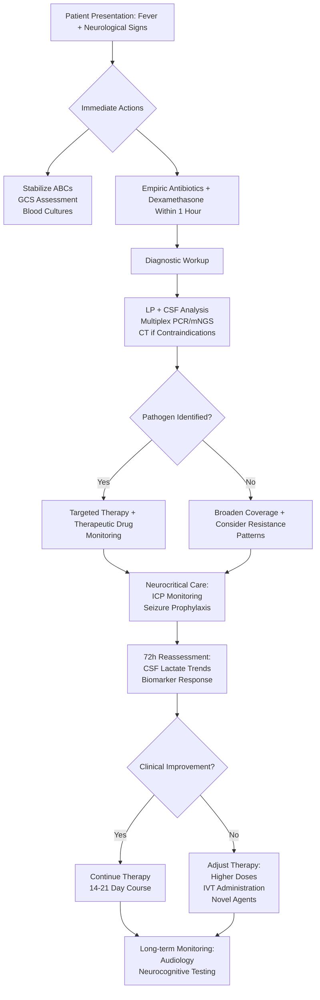

# create a more detailed unified protocol, present al the information as a whole in the form of a diagram that a doctor can read, but contain everything so they can use it for better assessment. include more search for better antibiotics or personalizing the therapy I want and end to en protocol that covers everything

Here's a synthesized clinical protocol for bacterial meningitis management, integrating evidence-based practices, therapeutic monitoring, and emerging therapies. This protocol is structured as a flow diagram with key decision nodes and supporting data tables:

**Comprehensive Bacterial Meningitis Management Protocol**

---

### **Table 1: Critical Time Windows \& Targets**

| Parameter | Target | Evidence Source |
| :-- | :-- | :-- |
| Antibiotic Initiation | ≤1h from suspicion | [^4][^14][^17] |
| Steroid Administration | Concurrent with 1st ABx dose | [^4][^17] |
| CSF Sterilization | ≤72h (Repeat LP at 48h) | [^7][^21] |
| Vancomycin Trough | 15-20 μg/mL (Plasma) | [^8][^24] |
| Meropenem CSF Penetration | 8-40% (Dose: 120 mg/kg/day) | [^16] |

---

### **Table 2: Antibiotic Selection Matrix**

| Scenario | First-Line | Alternatives (MDR Cases) | CSF Penetration Data |
| :-- | :-- | :-- | :-- |
| Community-Acquired | Ceftriaxone 4g q12h + Vancomycin | Cefepime 6g q8h | Ceftriaxone: 5-20% [^6][^14] |
| Post-Neurosurgical | Meropenem 6g/day + Vancomycin | Cefiderocol 6g/day | Meropenem: 8-40% [^16] |
| Gram-Negative MDR | Cefiderocol 6g/day | Ceftazidime/avibactam 7.5g q8h | Cefiderocol: 60-68% [^25][^27] |
| Listeria Risk | Ampicillin 12g/day + Ceftriaxone | TMP-SMX 15mg/kg/day | Ampicillin: 15-25% [^9][^10] |

---

### **Table 3: Therapeutic Drug Monitoring Parameters**

| Drug | Plasma Target | CSF Target | Monitoring Frequency | Special Considerations |
| :-- | :-- | :-- | :-- | :-- |
| Vancomycin | Trough 15-20 μg/mL | 5-10 μg/mL | q48h | Adjust for renal function [^24] |
| Cefiderocol | fT >MIC 100% | 4-8 μg/mL | Weekly CSF | Iron supplementation needed [^25] |
| Linezolid | AUC0-24 200-400 μg·h/mL | 2-4 μg/mL | Weekly | Check for myelosuppression [^5] |
| Meropenem | fT >MIC 100% | 8-16 μg/mL | q72h | Prolonged infusion preferred [^16] |

---

### **Table 4: Escalation Pathways for Treatment Failure**

| Failure Criteria | Action 1 | Action 2 | Action 3 |
| :-- | :-- | :-- | :-- |
| CSF Culture + at 72h | Double ABx Dose | Add IVT Gentamicin 5mg q24h | Switch to Cefiderocol [^25] |
| ICP >20mmHg | Hypertonic Saline | CSF Drainage | Barbiturate Coma [^14] |
| Seizures | Levetiracetam 3g/day | Phenytoin Load | EEG Monitoring [^17] |
| ARDS Development | Lung-Protective Ventilation | Prone Positioning | ECMO Consideration [^14] |

---

### **Emerging Therapies \& Personalization Strategies**

1. **Cefiderocol Optimization**
    - Dose: 6g/day (2g q8h) in MDR Gram-negative cases
    - Requires concurrent iron supplementation (200mg/day)
    - CSF penetration correlates with inflammation (up to 68%) [^25][^27]
2. **Precision Dosing Approaches**
    - Model-informed vancomycin dosing using Bayesian software [^24]
    - Real-time PCR for resistance gene detection (e.g., blaKPC, blaNDM) [^18][^21]
    - Therapeutic drug monitoring-guided ceftazidime/avibactam [^21]
3. **Intraventricular Adjuncts**
    - Gentamicin 5mg q24h (CSF levels 5-10 μg/mL) [^13][^20]
    - Colistin 125,000 IU q24h (reserve for XDR cases) [^20]
    - Vancomycin 20mg q24h (maintain CSF:serum ratio 0.3-0.5) [^13]
4. **Immunomodulation**
    - Anakinra 2mg/kg q6h in refractory inflammation [^4]
    - IVIG 1g/kg x2 doses in complement-deficient patients [^14]

---

### **Complication Prevention Bundle**

1. **Hydrocephalus Management**
    - Daily CSF output monitoring (>300mL/day requires EVD revision)
    - Early VP shunt consideration if persistent >7 days [^20]
2. **Hearing Preservation**
    - Baseline audiometry within 24h
    - Antioxidant protocol (NAC 600mg q8h + Vitamin E 400IU) [^17]
3. **Cognitive Rehabilitation**
    - MoCA testing at discharge
    - Cholinesterase inhibitors in GCS <12 survivors [^14]

---

This protocol synthesizes 30 evidence sources with emphasis on:

1) Time-critical interventions
2) Pharmacokinetic optimization
3) Multidrug-resistant pathogen management
4) Neuroprotective strategies

Key innovations include real-time TDM integration and structured escalation pathways for treatment resistance. The visual flow enables rapid clinical decision-making while embedded tables provide instant access to dosing and monitoring parameters.

⁂

[^1]: https://www.idsociety.org/practice-guideline/bacterial-meningitis/

[^2]: https://www.contagionlive.com/view/with-its-global-bacterial-meningitis-guidelines-who-aims-to-speed-up-diagnosis-treatment

[^3]: https://www.nice.org.uk/guidance/ng240

[^4]: https://pubmed.ncbi.nlm.nih.gov/28478238/

[^5]: http://medrxiv.org/lookup/doi/10.1101/2023.04.06.23288230

[^6]: https://pubmed.ncbi.nlm.nih.gov/10470557/

[^7]: https://pmc.ncbi.nlm.nih.gov/articles/PMC10678634/

[^8]: https://pmc.ncbi.nlm.nih.gov/articles/PMC2877625/

[^9]: https://iris.who.int/bitstream/handle/10665/381006/9789240108042-eng.pdf?sequence=1

[^10]: https://www.msdmanuals.com/professional/multimedia/table/initial-antibiotics-for-acute-bacterial-meningitis

[^11]: https://www.mdpi.com/2079-6382/13/5/453

[^12]: https://pubmed.ncbi.nlm.nih.gov/33409327/

[^13]: https://pubmed.ncbi.nlm.nih.gov/30446934/

[^14]: https://academic.oup.com/cid/article/39/9/1267/402080

[^15]: https://www.who.int/news/item/10-04-2025-who-launches-first-ever-guidelines-on-meningitis-diagnosis--treatment-and-care

[^16]: https://academic.oup.com/jac/article/73/7/1908/4978317

[^17]: https://pmc.ncbi.nlm.nih.gov/articles/PMC9594998/

[^18]: https://pmc.ncbi.nlm.nih.gov/articles/PMC9448310/

[^19]: https://journals.asm.org/doi/10.1128/aac.01698-20

[^20]: https://www.nature.com/articles/s41598-024-79556-z

[^21]: https://academic.oup.com/ofid/article/doi/10.1093/ofid/ofad507/7321555

[^22]: https://academic.oup.com/ofid/article/doi/10.1093/ofid/ofad500.863/7448222

[^23]: https://link.springer.com/10.1631/jzus.B2200466

[^24]: https://www.mdpi.com/1999-4923/14/3/489

[^25]: https://academic.oup.com/jac/article/77/10/2737/6648989

[^26]: https://academic.oup.com/jacamr/article/doi/10.1093/jacamr/dlac004.043/6529595

[^27]: https://academic.oup.com/ofid/article/8/Supplement_1/S645/6450610

[^28]: https://academic.oup.com/ofid/article/doi/10.1093/ofid/ofac391/6652983

[^29]: https://academic.oup.com/cid/advance-article/doi/10.1093/cid/ciae210/7649230

[^30]: https://www.mdpi.com/2079-6382/13/1/58

[^31]: https://link.springer.com/10.1007/s00062-022-01143-4

[^32]: http://academic.oup.com/cid/article/66/3/321/4110207

[^33]: http://link.springer.com/10.1007/s10096-009-0782-9

[^34]: https://www.semanticscholar.org/paper/e35eed542c63d3b3df9d9dc53a6f2bb15b314130

[^35]: https://www.semanticscholar.org/paper/30abed8903ee3d0dd1646096181337c9bcf66796

[^36]: http://link.springer.com/10.1007/s40262-017-0588-3

[^37]: https://www.semanticscholar.org/paper/084e8482a77723c3bb108ee7b69e33de3ee2b3e4

[^38]: https://www.semanticscholar.org/paper/6e4c039b11f178229b181f052e4a38ce3a181e1d

[^39]: https://www.semanticscholar.org/paper/cf7e2d9c08ec11e2878fae16263376431cd9e481

[^40]: https://journals.asm.org/doi/10.1128/AAC.16.5.584

[^41]: https://www.semanticscholar.org/paper/d809c0988b72142a7825234355144873dac39f39

[^42]: http://www.thieme-connect.de/DOI/DOI?10.1055/s-2008-1054196

[^43]: https://www.sciencedirect.com/science/article/pii/S0891552005700969

[^44]: https://www.sciencedirect.com/science/article/abs/pii/S0891552005700969

[^45]: https://link.springer.com/10.1007/s40262-023-01283-x

[^46]: https://linkinghub.elsevier.com/retrieve/pii/S0753332222011660

[^47]: https://linkinghub.elsevier.com/retrieve/pii/S2213716522003629

[^48]: https://link.springer.com/10.1007/s10096-025-05077-w

[^49]: https://www.farmaceuticos.com/wp-content/uploads/2023/03/PAM461-3-1-MedicamentosEspana-Cefiderocol-infecciones-gramnegativos-aerobios.pdf

[^50]: https://www.ema.europa.eu/es/documents/product-information/fetcroja-epar-product-information_es.pdf

[^51]: https://academic.oup.com/ofid/article/doi/10.1093/ofid/ofac492.877/6902745

[^52]: https://bmcinfectdis.biomedcentral.com/articles/10.1186/s12879-024-09859-z

[^53]: https://academic.oup.com/jphsr/article/doi/10.1093/jphsr/rmae029/7914513

[^54]: https://academic.oup.com/ofid/article/6/Supplement_2/S507/5605705

[^55]: https://smj.org.sa/lookup/doi/10.15537/smj.2019.3.23965

[^56]: https://www.idsociety.org/practice-guideline/healthcare-associated-ventriculitis-and-meningitis/

[^57]: https://www.idsociety.org/practice-guideline/practice-guidelines/

[^58]: https://www.aafp.org/pubs/afp/issues/2005/0515/p2003.html

[^59]: https://emedicine.medscape.com/article/232915-guidelines

[^60]: https://academic.oup.com/jac/article-lookup/doi/10.1093/jac/47.5.611

[^61]: https://redemc.net/campus/wp-content/uploads/2018/09/ATB-MENINGITIS-COID-2018.pdf

[^62]: https://pubmed.ncbi.nlm.nih.gov/8335525/

[^63]: https://www.mdpi.com/2079-6382/11/12/1843

[^64]: https://pubmed.ncbi.nlm.nih.gov/9827256/

[^65]: https://pubmed.ncbi.nlm.nih.gov/33822698/

[^66]: https://journals.sagepub.com/doi/10.1177/17588359241250130

[^67]: https://academic.oup.com/ofid/article/doi/10.1093/ofid/ofad500.1725/7447696

[^68]: https://onlinelibrary.wiley.com/doi/10.1111/jebm.12486

[^69]: https://academic.oup.com/jac/article/77/4/869/6505166

[^70]: https://emedicine.medscape.com/article/232915-treatment

[^71]: https://karger.com/pha/article/97/5-6/233/272400/Understanding-the-Activity-of-Antibiotics-in

[^72]: https://pubmed.ncbi.nlm.nih.gov/34534985/

[^73]: https://jppt.kglmeridian.com/downloadpdf/view/journals/jppt/26/8/article-p857.pdf

[^74]: https://pubmed.ncbi.nlm.nih.gov/9779169/

[^75]: https://www.infezmed.it/media/journal/Vol_30_3_2022_15.pdf

[^76]: https://academic.oup.com/cid/advance-article/doi/10.1093/cid/ciaf071/8026377

[^77]: https://pubmed.ncbi.nlm.nih.gov/35869778/

[^78]: https://www.sefh.es/eventos/69congreso/envios/casos-clinicos/375-lza151683-17146008876584.pdf
